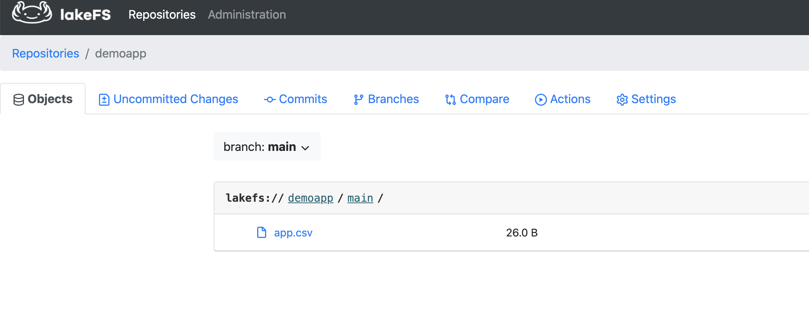
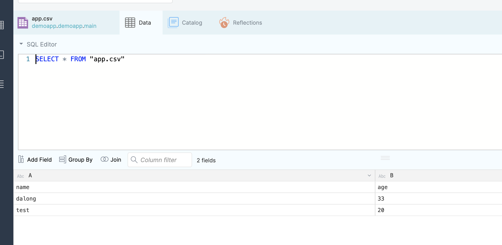

# dremio with lakefs

## starting

```code
docker-compose up -d
```

## init kakefs

```code
http://localhost:8000/setup
```

## mc  cmd 

```code
mc  config host add lakefs  http://127.0.0.1:8000 xxxx xxxxxxxx
mc ls lakefs
```

## dremio demo

add data lake with s3 (Enable compatibility mode )

```code
fs.s3a.path.style.access  true
fs.s3a.endpoint http://lakefs:8000
fs.s3a.connection.ssl.enabled false
```


## some images



